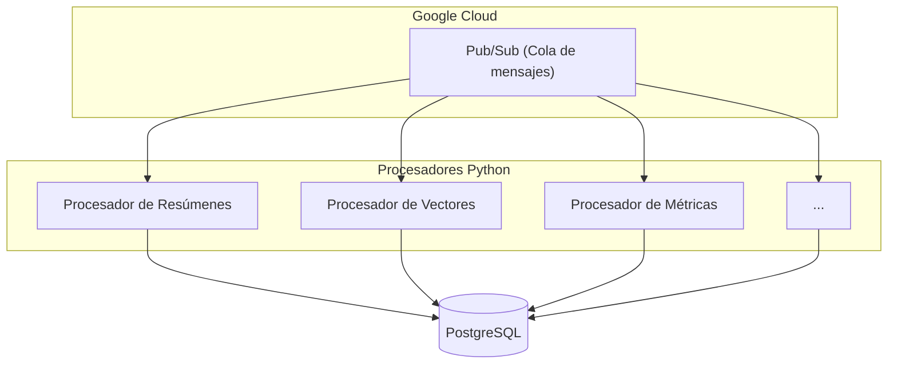
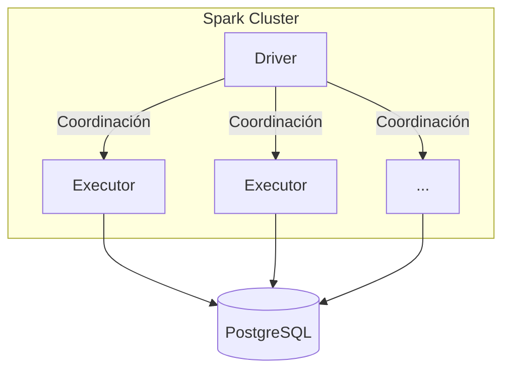
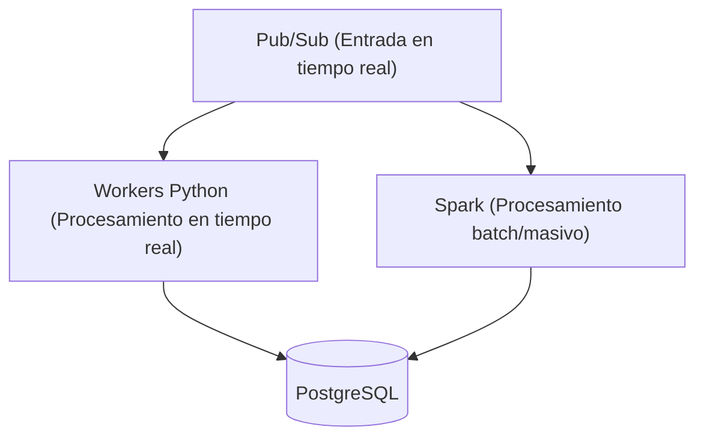

# Arquitectura de Base de Datos para Sistema de Procesamiento de Noticias

## Esquema Completo con Campos Opcionales y Mejoras Propuestas

```sql
---------------------------
-- Extensión pgvector (requiere privilegios de superusuario)
---------------------------
CREATE EXTENSION IF NOT EXISTS vector;

---------------------------
-- Tabla de Autores (Mejorada)
---------------------------
CREATE TABLE authors (
    id SERIAL PRIMARY KEY,
    name TEXT NOT NULL,
    organization TEXT,          -- Opcional
    profile TEXT,               -- Opcional
    social_media JSONB,         -- Opcional (ej: {"twitter": "@user", "linkedin": "url"})
    created_at TIMESTAMP WITH TIME ZONE DEFAULT CURRENT_TIMESTAMP,
    updated_at TIMESTAMP WITH TIME ZONE DEFAULT CURRENT_TIMESTAMP
);

---------------------------
-- Tabla Principal de Noticias (Con campos opcionales)
---------------------------
CREATE TABLE news (
    id SERIAL PRIMARY KEY,
    title TEXT NOT NULL,
    content TEXT NOT NULL,
    summary TEXT,               -- Opcional (generado por procesador)
    embedding VECTOR(1536),     -- Opcional (depende de procesamiento)
    summary_embedding VECTOR(1536), -- Opcional
    topic_classification JSONB, -- Opcional (ej: {"main": "politica", "sub": "elecciones"})
    writing_analysis JSONB,     -- Opcional (análisis de redacción)
    published_at TIMESTAMP WITH TIME ZONE DEFAULT NOW(),
    author_id INTEGER REFERENCES authors(id) ON DELETE SET NULL, -- Opcional
    facts JSONB,                -- Opcional (hechos extraídos)
    entities JSONB,             -- Opcional (entidades reconocidas)
    keywords TEXT[],            -- Opcional (palabras clave)
    ambiguity_score FLOAT,      -- Opcional
    context_score FLOAT,        -- Opcional
    relevance_score FLOAT,      -- Opcional
    created_at TIMESTAMP WITH TIME ZONE DEFAULT CURRENT_TIMESTAMP,
    updated_at TIMESTAMP WITH TIME ZONE DEFAULT CURRENT_TIMESTAMP
);

---------------------------
-- Metadatos de Scraping (Obligatorios para trazabilidad)
---------------------------
CREATE TABLE scraping_metadata (
    id SERIAL PRIMARY KEY,
    news_id INTEGER NOT NULL REFERENCES news(id) ON DELETE CASCADE,
    source TEXT NOT NULL,
    url TEXT NOT NULL,
    original_published_at TIMESTAMP WITH TIME ZONE, -- Opcional
    http_status SMALLINT,        -- Opcional
    headers JSONB,               -- Opcional
    raw_html TEXT,               -- Opcional (para debugging)
    created_at TIMESTAMP WITH TIME ZONE DEFAULT CURRENT_TIMESTAMP
);

---------------------------
-- Tabla de Etiquetas (Mejorada)
---------------------------
CREATE TABLE tags (
    id SERIAL PRIMARY KEY,
    name TEXT NOT NULL UNIQUE,
    type TEXT NOT NULL DEFAULT 'user' CHECK (type IN ('auto', 'user', 'system')),
    created_at TIMESTAMP WITH TIME ZONE DEFAULT CURRENT_TIMESTAMP
);

---------------------------
-- Relación Noticias-Etiquetas (Mejorada)
---------------------------
CREATE TABLE news_tags (
    news_id INTEGER NOT NULL REFERENCES news(id) ON DELETE CASCADE,
    tag_id INTEGER NOT NULL REFERENCES tags(id) ON DELETE CASCADE,
    confidence FLOAT,            -- Opcional (para etiquetas automáticas)
    source TEXT,                 -- Opcional (ej: 'modelo-ner', 'usuario:123')
    created_at TIMESTAMP WITH TIME ZONE DEFAULT CURRENT_TIMESTAMP,
    PRIMARY KEY (news_id, tag_id)
);

---------------------------
-- Tabla de Métricas de Calidad Periodística (Nueva)
---------------------------
CREATE TABLE journalistic_metrics (
    id SERIAL PRIMARY KEY,
    news_id INTEGER NOT NULL REFERENCES news(id) ON DELETE CASCADE,
    objectivity_score FLOAT,     -- Opcional
    source_transparency_score FLOAT, -- Opcional
    diversity_score FLOAT,       -- Opcional
    context_score FLOAT,         -- Opcional
    factual_consistency_score FLOAT, -- Opcional
    created_at TIMESTAMP WITH TIME ZONE DEFAULT CURRENT_TIMESTAMP
);

---------------------------
-- Tabla de Estado de Procesamiento (Crítica para pipeline)
---------------------------
CREATE TABLE processing_status (
    news_id INTEGER PRIMARY KEY REFERENCES news(id) ON DELETE CASCADE,
    is_summarized BOOLEAN NOT NULL DEFAULT FALSE,
    is_vector_generated BOOLEAN NOT NULL DEFAULT FALSE,
    is_categorized BOOLEAN NOT NULL DEFAULT FALSE,
    is_quality_analyzed BOOLEAN NOT NULL DEFAULT FALSE,
    last_processed_at TIMESTAMP WITH TIME ZONE,
    retry_count INTEGER NOT NULL DEFAULT 0,
    error_log TEXT[]             -- Opcional (histórico de errores)
);

---------------------------
-- Índices Especializados (Optimización)
---------------------------
-- Índice para búsqueda semántica
CREATE INDEX idx_news_embedding_cosine 
    ON news USING ivfflat (embedding vector_cosine_ops) 
    WITH (lists = 100);

-- Índice para búsqueda full-text
CREATE INDEX idx_news_content_search 
    ON news USING GIN (to_tsvector('spanish', content));

-- Índice para fechas de publicación
CREATE INDEX idx_news_published_at 
    ON news (published_at DESC);

-- Índice parcial para estado de procesamiento
CREATE INDEX idx_processing_status_pending 
    ON processing_status (news_id) 
    WHERE NOT (is_summarized AND is_vector_generated AND is_categorized);
```

## Análisis de Opcionalidad de Campos

1. **Campos Obligatorios**:
   - Todos los campos marcados como `NOT NULL`
   - Identificadores y metadatos básicos de trazabilidad

2. **Campos Opcionales**:
   - Campos derivados de procesamiento (ej: `embedding`, `summary`)
   - Métricas calculadas (ej: `ambiguity_score`)
   - Información complementaria (ej: `social_media` en autores)

3. **Estrategia de NULLs**:
   - Usar valores NULL para indicar datos no procesados/no disponibles
   - Campos JSONB permiten almacenar estructuras parciales
   - Arrays vacíos (`'{}'`) para colecciones sin elementos

## Arquitectura de Procesamiento Recomendada

### 1. Opción 1: Pub/Sub + Python (MVP Escalable)


**Ventajas**:
- **Manejo de Carga Variable**: Escalado automático con Cloud Run o Kubernetes
- **Tolerancia a Fallos**: Reintentos automáticos vía políticas de Pub/Sub
- **Costo Efectivo**: Pago por uso, ideal para cargas variables
- **Integración Nativa**: Client libraries para Python de última generación

**Implementación**:
```python
# Ejemplo de consumidor Pub/Sub con Python
from concurrent.futures import TimeoutError
from google.cloud import pubsub_v1

subscriber = pubsub_v1.SubscriberClient()
subscription_path = subscriber.subscription_path(project_id, subscription_id)

def callback(message):
    try:
        process_message(message.data)
        message.ack()
    except Exception as e:
        message.nack()

streaming_pull_future = subscriber.subscribe(subscription_path, callback=callback)

with subscriber:
    try:
        streaming_pull_future.result()
    except TimeoutError:
        streaming_pull_future.cancel()
```

### 2. Opción 2: Apache Spark (Cargas Masivas Complejas)


**Ventajas**:
- **Procesamiento Batch Masivo**: Ideal para reprocesamientos completos
- **Algoritmos Complejos**: ML avanzado o procesamiento distribuido
- **Ecosistema Integrado**: Spark ML para modelos de NLP

**Implementación**:
```scala
// Ejemplo de Spark Structured Streaming
val newsStream = spark.readStream
  .format("kafka")
  .option("kafka.bootstrap.servers", "host:port")
  .option("subscribe", "news-topic")
  .load()

val processed = newsStream
  .select(from_json($"value".cast("string"), schema).as("news"))
  .transform(enrichWithSummaries)
  .transform(generateEmbeddings)

processed.writeStream
  .foreachBatch { (batchDF, batchId) =>
    batchDF.write
      .format("jdbc")
      .option("url", "jdbc:postgresql://host/db")
      .option("dbtable", "news")
      .mode("append")
      .save()
  }
  .start()
```

### Recomendación Final

**Para MVP y Escalabilidad Inicial**:
1. **Pub/Sub + Python**:
   - Menor complejidad operacional
   - Escalamiento automático
   - Costos proporcionales al uso
   - Integración más sencilla con PostgreSQL

2. **Spark Structured Streaming**:
   - Requerido solo si:
     - Volumen > 1M documentos/día
     - Necesidad de joins complejos entre streams
     - Procesamiento con modelos de ML distribuidos

**Arquitectura Híbrida**:


**Ventajas**:
- Tiempo real + batch en misma infraestructura
- Uso óptimo de recursos
- Migración progresiva de cargas

## Consideraciones de Performance

1. **Conexiones a PostgreSQL**:
   - Usar `PgBouncer` para connection pooling [1]
   - Tamaño de pool = (Núcleos * 2) + 1

2. **Optimización de Índices**:
   - Mantener índices en tablespaces separados [12]
   - Reindexar semanalmente con `REINDEX CONCURRENTLY`

3. **Particionamiento**:
   - Particionar tabla `news` por `published_at`
   - Usar particionamiento nativo de PostgreSQL [14]

```sql
-- Ejemplo de particionamiento por fecha
CREATE TABLE news (
    id SERIAL,
    published_at DATE NOT NULL,
    ...
) PARTITION BY RANGE (published_at);

CREATE TABLE news_2024 PARTITION OF news
    FOR VALUES FROM ('2024-01-01') TO ('2024-12-31');
```

## Conclusión

El DDL presentado ofrece un balance entre flexibilidad para procesamiento asíncrono y estructura robusta para análisis complejos. La elección entre Pub/Sub+Python y Spark debe basarse en:

1. **Volumen de Datos**: 
   -  500K documentos/día: Spark

2. **Complejidad de Procesamiento**:
   - Transformaciones simples: Python
   - ML distribuido: Spark

3. **Requerimientos de Latencia**:
   - Tiempo real estricto (<1s): Pub/Sub
   - Near real-time (<5m): Spark Structured Streaming

Como paso siguiente, recomiendo implementar primero la solución Python+Pub/Sub con monitoreo estricto de performance, y escalar a Spark solo si se requieren capacidades de procesamiento distribuidas avanzadas.

Citations:
[1] https://www.instaclustr.com/education/top-10-postgresql-best-practices-for-2025/
[2] https://stackoverflow.com/questions/78187094/is-there-a-such-thing-as-optional-types-in-sql
[3] https://airbyte.com/data-engineering-resources/create-database-schema-in-postgresql
[4] https://github.com/pgvector/pgvector
[5] https://www.timescale.com/learn/postgresql-extensions-pgvector
[6] https://neon.tech/docs/extensions/pgvector
[7] https://spark.apache.org/streaming/
[8] https://risingwave.com/blog/google-pub-sub-integration-with-python-a-complete-guide/
[9] https://www.timescale.com/learn/postgresql-database-operations
[10] https://www.datacamp.com/tutorial/pgvector-tutorial
[11] https://spark.apache.org/docs/latest/structured-streaming-programming-guide.html
[12] https://www.postgresql.org/docs/current/performance-tips.html
[13] https://blog.geomusings.com/2024/07/19/image-similarity-with-pgvector/
[14] https://www.postgresql.org/docs/current/ddl.html
[15] https://docs.yugabyte.com/preview/explore/ysql-language-features/pg-extensions/extension-pgvector/
[16] https://docs.pingcap.com/tidb/stable/ddl-introduction
[17] https://www.commandprompt.com/education/postgresql-data-definition-language-ddl/
[18] https://www.reddit.com/r/PostgreSQL/comments/1h0zt4u/postgresql_best_practices_guidelines/
[19] https://learn.saylor.org/mod/book/view.php?id=65088&chapterid=57858
[20] https://dba.stackexchange.com/questions/313481/database-design-for-news-feed
[21] https://dev.to/mehmetakar/postgresql-vector-database-pgvector-tutorial-2dmd
[22] https://www.enterprisedb.com/blog/what-is-pgvector
[23] https://quix.io/blog/beam-vs-spark-big-data-solutions-compared
[24] https://cloud.google.com/python/docs/reference/pubsub/latest
[25] https://www.sqlservercentral.com/articles/nullable-vs-non-nullable-columns-and-adding-not-null-without-downtime-in-postgresql
[26] https://stackoverflow.com/questions/40443887/how-to-define-that-an-attribute-is-optional/40443904
[27] https://www.databricks.com/blog/unlock-power-real-time-data-processing-databricks-and-google-cloud
[28] https://cloud.google.com/kubernetes-engine/docs/tutorials/deploy-pgvector
[29] https://spark.apache.org/docs/latest/streaming-programming-guide.html
[30] https://blog.damavis.com/ejemplos-practicos-con-apache-spark-structured-streaming/
[31] https://www.datacouncil.ai/talks/building-real-time-data-pipelines-made-easy-with-structured-streaming-in-apache-spark
[32] https://cloud.google.com/blog/products/data-analytics/pubsub-lite-for-your-streaming-applications
[33] https://towardsdatascience.com/mastering-data-streaming-in-python-a88d4b3abf8b/
[34] https://sunscrapers.com/blog/how-to-build-a-streaming-data-pipeline-with-apache-kafka-and-spark/
[35] https://pitt-broker.readthedocs.io/en/v-0.6.1-tjr/access-data/pubsub.html
[36] https://cloud.google.com/pubsub/docs/publish-best-practices
[37] https://cloud.google.com/dataflow/docs/concepts/streaming-with-cloud-pubsub
[38] https://www.youtube.com/watch?v=6_7nBReSpNM
[39] https://www.reddit.com/r/softwarearchitecture/comments/1d2e3bc/pubsub_for_data_processing_pipeline/
[40] https://github.com/BackendStack21/realtime-pubsub-client-python
[41] https://www.cloudskillsboost.google/focuses/19288?parent=catalog
[42] https://www.postgresql.org/docs/current/ddl-constraints.html
[43] https://www.reddit.com/r/SQL/comments/hv9zsc/how_to_handle_a_lot_of_optional_columns_in_a/
[44] https://dba.stackexchange.com/questions/285302/why-columns-in-views-are-always-nullable
[45] https://stackoverflow.com/questions/75761662/databases-how-to-handle-optional-columns
[46] https://www.baeldung.com/sql/nullable-column
[47] https://www.red-gate.com/hub/product-learning/sql-prompt/why-you-should-always-specify-whether-a-column-accepts-nulls
[48] https://stackoverflow.com/questions/59792099/how-could-i-read-fast-enough-from-google-pub-sub-using-python
[49] https://quix.io/blog/performance-limitations-python-client-libraries
[50] https://www.trustradius.com/compare-products/apache-spark-vs-google-cloud-pub-sub
[51] https://community.databricks.com/t5/technical-blog/high-throughput-exactly-once-streaming-from-google-pub-sub-with/ba-p/52616
[52] https://www.pluralsight.com/resources/blog/software-development/scala-vs-python

---
Respuesta de Perplexity: pplx.ai/share