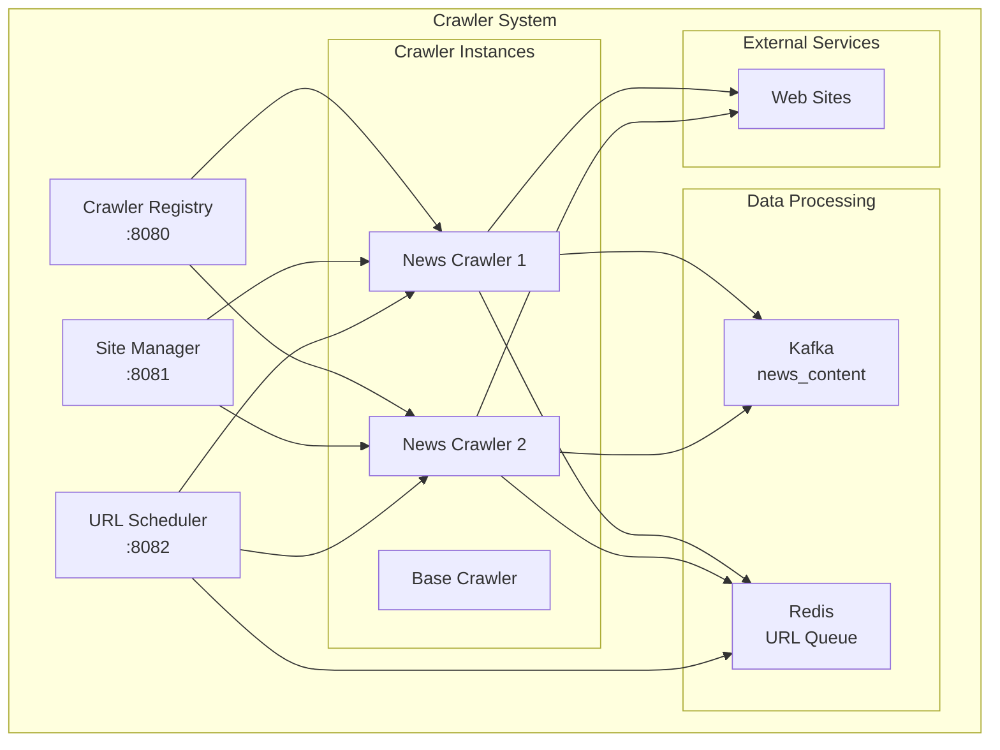
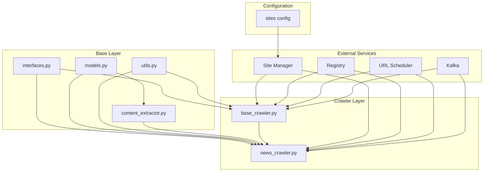
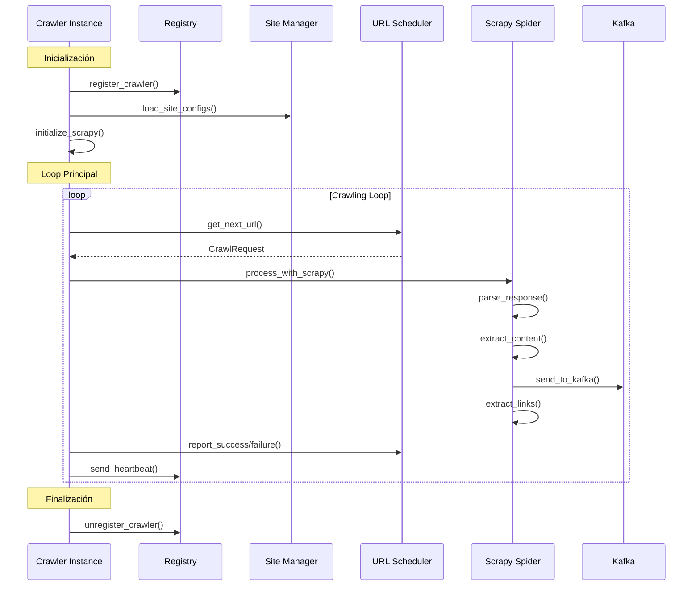
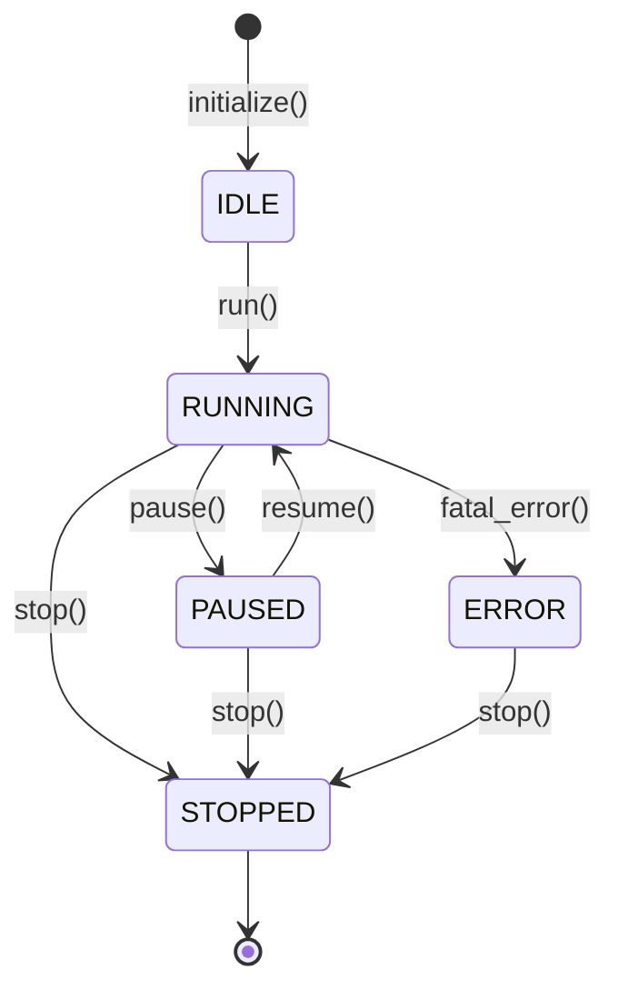

# Sistema de Crawlers OpenMedia

## 📋 Índice
- [Arquitectura General](#arquitectura-general)
- [Árbol de Dependencias](#árbol-de-dependencias)
- [Componentes Principales](#componentes-principales)
- [Flujo de Trabajo](#flujo-de-trabajo)
- [BaseCrawler - Documentación Técnica](#basecrawler---documentación-técnica)
- [NewsCrawler - Especialización](#newscrawler---especialización)
- [Utilidades del Sistema (utils.py)](#utilidades-del-sistema-utilspy)
- [Modelos de Datos (models.py)](#modelos-de-datos-modelspy)
- [Configuración de Sitios](#configuración-de-sitios)
- [Gestión de Sitios](#gestión-de-sitios)
- [Extracción de Contenido](#extracción-de-contenido)
- [Integración con Scrapy](#integración-con-scrapy)
- [Manejo de Errores](#manejo-de-errores)
- [Métricas y Monitoreo](#métricas-y-monitoreo)

## 🏗️ Arquitectura General



## 🌳 Árbol de Dependencias

```
crawlers/
├── base/                           # Módulos base del sistema
│   ├── __init__.py                # Exporta interfaces principales
│   ├── interfaces.py              # Contratos y abstracciones
│   ├── models.py                  # Modelos de datos (Article, WebPage)
│   ├── utils.py                   # Utilidades del sistema
│   └── content_extractor.py       # Extractor de contenido avanzado
│
├── crawlers/                      # Implementaciones de crawlers
│   ├── __init__.py               # Exporta crawlers disponibles
│   ├── base_crawler.py           # Crawler base con Scrapy
│   ├── news_crawler.py           # Crawler especializado en noticias
│   └── README.md                 # Esta documentación
│
├── config/                       # Configuraciones
│   └── sites/                    # Configuraciones de sitios
│       └── chile_news.json       # Sitios chilenos configurados
│
├── services/                     # Servicios externos
│   ├── registry/                 # Registro de crawlers
│   ├── scheduler/                # Programador de URLs
│   ├── site_manager/             # Gestor de sitios
│   └── monitoring/               # Monitoreo y métricas
│
└── scripts/                      # Scripts de utilidad
    └── start-crawling.sh         # Script de inicio
```

### Dependencias entre Módulos



## 🔧 Componentes Principales

### 1. BaseCrawler (`base_crawler.py`)
**Clase base abstracta que implementa la interfaz `ICrawler`**

#### Responsabilidades:
- ✅ Gestión del ciclo de vida del crawler
- ✅ Comunicación con servicios externos (Registry, Site Manager, Scheduler)
- ✅ Integración con Scrapy framework
- ✅ Manejo de métricas y heartbeats
- ✅ Procesamiento de requests y responses

### 2. NewsCrawler (`news_crawler.py`)
**Especialización para sitios de noticias**

#### Responsabilidades:
- ✅ Extracción específica de artículos de noticias
- ✅ Validación de contenido periodístico
- ✅ Envío a pipeline de procesamiento
- ✅ Manejo de metadatos específicos de noticias

### 3. OpenMediaSpider (dentro de `base_crawler.py`)
**Spider de Scrapy personalizado**

#### Responsabilidades:
- ✅ Parsing de HTML con selectores configurables
- ✅ Extracción de links y contenido
- ✅ Envío a Kafka
- ✅ Manejo de delays y políticas de crawling

## 🔄 Flujo de Trabajo



## 📚 BaseCrawler - Documentación Técnica

### Estructura de Clases

```python
class BaseCrawler(ICrawler):
    """
    Implementación base del crawler usando Scrapy framework
    """
```

### Atributos Principales

| Atributo | Tipo | Descripción |
|----------|------|-------------|
| `crawler_id` | `str` | UUID único del crawler |
| `crawler_type` | `str` | Tipo de crawler (base, news, etc.) |
| `status` | `CrawlerStatus` | Estado actual del crawler |
| `config` | `Dict[str, Any]` | Configuración del crawler |
| `site_configs` | `Dict[str, SiteConfig]` | Configuraciones de sitios asignados |
| `metrics` | `Dict[str, Any]` | Métricas de rendimiento |
| `runner` | `CrawlerRunner` | Runner de Scrapy |

### Métodos Principales

#### 🚀 Inicialización

```python
def initialize(self, config: Dict[str, Any]) -> bool:
    """
    Inicializa el crawler con configuración
    
    Flujo:
    1. Actualiza configuración interna
    2. Configura settings de Scrapy
    3. Inicializa CrawlerRunner
    4. Se registra en Registry
    5. Carga configuraciones de sitios
    """
```

**Settings de Scrapy configurados:**
```python
settings = {
    'ROBOTSTXT_OBEY': True,           # Respeta robots.txt
    'DOWNLOAD_DELAY': 1.0,            # Delay entre requests
    'RANDOMIZE_DOWNLOAD_DELAY': 0.5,  # Randomización del delay
    'CONCURRENT_REQUESTS': 1,         # Requests concurrentes
    'CONCURRENT_REQUESTS_PER_DOMAIN': 1,  # Por dominio
    'USER_AGENT': 'OpenMedia-Crawler/1.0',
    'TELNETCONSOLE_ENABLED': False,
    'LOG_LEVEL': 'INFO'
}
```

#### 🔄 Loop Principal

```python
def run(self):
    """
    Loop principal del crawler
    
    Flujo:
    1. Cambia status a RUNNING
    2. Mientras status == RUNNING:
       a. Obtiene próxima URL del scheduler
       b. Procesa request con Scrapy
       c. Envía heartbeat al registry
       d. Maneja errores y reintentos
    """
```

#### 🕷️ Procesamiento con Scrapy

```python
def _process_request_with_scrapy(self, request: CrawlRequest):
    """
    Procesa request usando Scrapy Spider
    
    Flujo:
    1. Obtiene configuración del sitio
    2. Crea instancia de OpenMediaSpider
    3. Configura spider con site_config
    4. Crea Scrapy Request
    5. Ejecuta crawling (simulado por ahora)
    """
```

#### 📊 Gestión de Métricas

```python
def get_metrics(self) -> Dict[str, Any]:
    """
    Retorna métricas de rendimiento
    
    Métricas incluidas:
    - requests_made: Total de requests realizados
    - requests_successful: Requests exitosos
    - requests_failed: Requests fallidos
    - urls_extracted: URLs extraídas
    - start_time: Tiempo de inicio
    - last_request_time: Último request
    - status: Estado actual
    - assigned_sites: Sitios asignados
    """
```

## 🗞️ NewsCrawler - Especialización

### Métodos Específicos

#### 📄 Extracción de Artículos

```python
async def extract_content(self, url: str, html: str, site_config: Dict[str, Any]) -> Optional[Article]:
    """
    Extrae contenido de artículo desde HTML
    
    Proceso:
    1. Obtiene selectores específicos del sitio
    2. Usa ContentExtractor para extraer:
       - Título
       - Contenido
       - Autor
       - Fecha de publicación
       - Resumen
    3. Valida si es un artículo válido
    4. Retorna objeto Article o None
    """
```

#### ✅ Validación de Artículos

```python
def _is_valid_article(self, article: Article) -> bool:
    """
    Valida si el contenido extraído es un artículo válido
    
    Criterios:
    - Contenido mínimo: 100 caracteres
    - Título mínimo: 10 caracteres
    - No contiene indicadores de páginas no-artículo:
      * privacy policy, terms of service
      * about us, contact us
      * subscribe, newsletter
    """
```

#### 📤 Procesamiento de Resultados

```python
async def process_crawl_result(self, result: CrawlResult) -> None:
    """
    Procesa resultado del crawling
    
    Acciones:
    1. Envía contenido a Kafka (topic: content.extracted)
    2. Actualiza estadísticas de crawling
    3. Maneja errores de procesamiento
    """
```

## 🛠️ Utilidades del Sistema (utils.py)

El módulo `utils.py` proporciona funciones esenciales para el funcionamiento del sistema de crawlers.

### Funciones de Configuración

#### 🔧 setup_logging()
```python
def setup_logging(level: str = "INFO", service_name: str = "crawler") -> None:
    """
    Configura logging estructurado para el servicio
    
    Características:
    - Logging estructurado con structlog
    - Formato JSON para logs
    - Timestamps ISO
    - Context de servicio
    - Stack traces automáticos
    """
```

#### ⚙️ get_config()
```python
def get_config(config_path: Optional[str] = None) -> Dict[str, Any]:
    """
    Carga configuración desde archivo o variables de entorno
    
    Configuraciones incluidas:
    - Kafka: bootstrap_servers, topic_prefix
    - Redis: host, port, db, password
    - PostgreSQL: host, port, database, credentials
    - Crawler: user_agent, delays, timeouts
    - Service: host, port, debug mode
    
    Prioridad: ENV vars > archivo config
    """
```

### Funciones de URL

#### ✅ validate_url()
```python
def validate_url(url: str) -> bool:
    """Valida formato de URL usando validators library"""
```

#### 🌐 extract_domain()
```python
def extract_domain(url: str) -> str:
    """
    Extrae dominio principal de URL
    
    Ejemplo:
    - https://www.emol.com/news/article -> emol.com
    - https://subdomain.latercera.com -> latercera.com
    """
```

#### 🔄 normalize_url()
```python
def normalize_url(url: str, base_url: Optional[str] = None) -> str:
    """
    Normaliza URL eliminando fragmentos y parámetros
    
    Proceso:
    1. Convierte URLs relativas a absolutas
    2. Normaliza esquema y dominio
    3. Elimina fragmentos (#)
    4. Mantiene query parameters
    """
```

### Funciones de Politeness

#### ⏱️ calculate_crawl_delay()
```python
def calculate_crawl_delay(site_config: Dict[str, Any], default_delay: float = 1.0) -> float:
    """
    Calcula delay apropiado basado en configuración y rate limits
    
    Lógica:
    - Toma delay configurado del sitio
    - Calcula delay mínimo basado en rate_limit
    - Retorna el mayor de ambos valores
    
    Ejemplo:
    - rate_limit: 30 req/min -> min_delay: 2.0s
    - crawl_delay: 1.5s -> resultado: 2.0s
    """
```

#### 🚫 is_allowed_domain()
```python
def is_allowed_domain(url: str, allowed_domains: list) -> bool:
    """
    Verifica si dominio de URL está en lista permitida
    
    Soporta:
    - Dominios exactos: emol.com
    - Subdominios: *.emol.com
    - Matching bidireccional
    """
```

### Funciones de Robots.txt

#### 🤖 parse_robots_txt()
```python
def parse_robots_txt(robots_content: str, user_agent: str = "*") -> Dict[str, Any]:
    """
    Parsea contenido de robots.txt
    
    Extrae:
    - Rutas permitidas (Allow)
    - Rutas prohibidas (Disallow)
    - Crawl delay específico
    - URLs de sitemaps
    
    Retorna:
    {
        'allowed': ['/news/', '/articles/'],
        'disallowed': ['/admin/', '/private/'],
        'crawl_delay': 2.0,
        'sitemap': ['https://site.com/sitemap.xml']
    }
    """
```

#### ✅ is_robots_allowed()
```python
def is_robots_allowed(url: str, robots_rules: Dict[str, Any]) -> bool:
    """
    Verifica si URL está permitida según robots.txt
    
    Lógica:
    1. Verifica allows explícitos primero
    2. Luego verifica disallows
    3. Por defecto permite si no hay reglas
    """
```

### Funciones de Utilidad

#### 🖥️ get_host_info()
```python
def get_host_info() -> Dict[str, str]:
    """
    Obtiene información del host actual
    
    Retorna:
    {
        'hostname': 'crawler-node-1',
        'platform': 'Linux-5.4.0-x86_64',
        'python_version': '3.9.7',
        'architecture': '64bit'
    }
    """
```

#### 🧹 sanitize_filename()
```python
def sanitize_filename(filename: str) -> str:
    """
    Sanitiza nombre de archivo para almacenamiento seguro
    
    - Reemplaza caracteres inválidos con '_'
    - Limita longitud a 255 caracteres
    - Mantiene extensión si existe
    """
```

#### 🕷️ create_user_agent()
```python
def create_user_agent(service_name: str = "OpenMedia-Crawler", version: str = "1.0") -> str:
    """
    Crea User-Agent apropiado
    
    Formato: "OpenMedia-Crawler/1.0 (+https://github.com/openmedia/crawler)"
    """
```

## 📊 Modelos de Datos (models.py)

Define las estructuras de datos principales del sistema.

### Article (Artículo de Noticias)

```python
@dataclass
class Article:
    """Representa un artículo de noticias extraído"""
    
    # Campos obligatorios
    title: str                          # Título del artículo
    content: str                        # Contenido principal
    url: str                           # URL original
    
    # Campos opcionales
    author: Optional[str] = None        # Autor del artículo
    published_date: Optional[datetime] = None  # Fecha de publicación
    summary: Optional[str] = None       # Resumen/bajada
    category: Optional[str] = None      # Categoría (política, deportes, etc.)
    tags: List[str] = field(default_factory=list)  # Tags/etiquetas
    
    # Metadatos
    metadata: Dict[str, Any] = field(default_factory=dict)  # Datos adicionales
    extracted_at: datetime = field(default_factory=datetime.utcnow)  # Timestamp extracción
```

#### Métodos del Article

```python
def dict(self) -> Dict[str, Any]:
    """
    Convierte a diccionario para serialización
    
    Uso:
    - Envío a Kafka
    - Almacenamiento en base de datos
    - APIs REST
    
    Maneja automáticamente:
    - Conversión de datetime a ISO string
    - Serialización de campos opcionales
    """
```

### WebPage (Página Web General)

```python
@dataclass
class WebPage:
    """Representa una página web extraída (no específicamente noticias)"""
    
    # Campos obligatorios
    title: str                          # Título de la página
    content: str                        # Contenido principal
    url: str                           # URL original
    
    # Campos opcionales
    description: Optional[str] = None   # Meta description
    keywords: List[str] = field(default_factory=list)  # Keywords/meta tags
    language: Optional[str] = None      # Idioma detectado
    
    # Metadatos
    metadata: Dict[str, Any] = field(default_factory=dict)
    extracted_at: datetime = field(default_factory=datetime.utcnow)
```

### CrawlResult (Re-exportado)

```python
# Re-exportado desde interfaces.py
from .interfaces import CrawlResult
```

### Uso de los Modelos

#### En NewsCrawler:
```python
# Crear artículo
article = Article(
    title="Título extraído",
    content="Contenido del artículo...",
    url="https://emol.com/article/123",
    author="Juan Pérez",
    category="Política"
)

# Serializar para Kafka
article_data = article.dict()
```

#### En ContentExtractor:
```python
# Extraer y crear modelo
article = self.content_extractor.extract_article(
    html=response.text,
    url=response.url,
    title_selector=selectors.get('title'),
    content_selector=selectors.get('content')
)
```

## ⚙️ Configuración de Sitios

### Estructura SiteConfig

```python
@dataclass
class SiteConfig:
    domain: str                    # Dominio del sitio
    name: str                     # Nombre descriptivo
    base_urls: List[str]          # URLs base para iniciar
    allowed_domains: List[str]    # Dominios permitidos
    crawl_delay: float = 1.0      # Delay entre requests
    concurrent_requests: int = 1   # Requests concurrentes
    user_agent: str               # User agent personalizado
    respect_robots_txt: bool = True
    custom_headers: Dict[str, str] # Headers personalizados
    selectors: Dict[str, str]     # Selectores CSS/XPath
    rate_limit: int = 60          # Requests por minuto
    priority: int = 1             # Prioridad del sitio
    enabled: bool = True          # Sitio habilitado
```

### Selectores Configurables

```python
selectors = {
    'title': 'h1.article-title',           # Título del artículo
    'content': '.article-content p',       # Contenido principal
    'author': '.author-name',              # Autor
    'date': '.publish-date',               # Fecha de publicación
    'category': '.category-tag',           # Categoría
    'summary': '.article-summary'          # Resumen
}
```

## 🏗️ Gestión de Sitios

### Archivo de Configuración: `config/sites/chile_news.json`

El sistema utiliza archivos JSON para configurar los sitios a crawlear. Actualmente solo tenemos sitios chilenos configurados.

#### Estructura del Archivo

```json
{
  "sites": [
    {
      "domain": "emol.com",
      "name": "El Mercurio Online",
      "base_urls": [
        "https://www.emol.com/",
        "https://www.emol.com/noticias/"
      ],
      "allowed_domains": [
        "emol.com",
        "www.emol.com"
      ],
      "selectors": {
        "title": "h1.titular::text",
        "content": "div.cuerpo-noticia p::text",
        "author": "span.autor::text",
        "date": "time::attr(datetime)",
        "category": "nav.breadcrumb a:last-child::text"
      },
      "crawl_delay": 2.0,
      "concurrent_requests": 2,
      "rate_limit": 30,
      "priority": 1,
      "enabled": true,
      "respect_robots_txt": true,
      "user_agent": "OpenMedia-Crawler/1.0",
      "custom_headers": {
        "Accept": "text/html,application/xhtml+xml,application/xml;q=0.9,*/*;q=0.8",
        "Accept-Language": "es-CL,es;q=0.8,en;q=0.6"
      }
    }
  ]
}
```

### Sitios Chilenos Configurados

| Sitio | Dominio | Delay | Rate Limit | Prioridad | Estado |
|-------|---------|-------|------------|-----------|--------|
| **El Mercurio Online** | emol.com | 2.0s | 30 req/min | 1 | ✅ Activo |
| **La Tercera** | latercera.com | 1.5s | 40 req/min | 1 | ✅ Activo |
| **BioBio Chile** | biobiochile.cl | 1.0s | 50 req/min | 2 | ✅ Activo |
| **Radio Cooperativa** | cooperativa.cl | 1.5s | 35 req/min | 2 | ✅ Activo |

### Cómo Modificar Sitios

#### ➕ Agregar un Nuevo Sitio

1. **Editar el archivo de configuración:**
```bash
nano crawlers/config/sites/chile_news.json
```

2. **Agregar nueva configuración:**
```json
{
  "domain": "nuevositio.cl",
  "name": "Nuevo Sitio de Noticias",
  "base_urls": [
    "https://nuevositio.cl/",
    "https://nuevositio.cl/noticias/"
  ],
  "allowed_domains": [
    "nuevositio.cl"
  ],
  "selectors": {
    "title": "h1.title::text",
    "content": ".article-content p::text",
    "author": ".author::text",
    "date": ".date::attr(datetime)",
    "category": ".category::text"
  },
  "crawl_delay": 1.5,
  "concurrent_requests": 2,
  "rate_limit": 40,
  "priority": 2,
  "enabled": true,
  "respect_robots_txt": true,
  "user_agent": "OpenMedia-Crawler/1.0",
  "custom_headers": {
    "Accept-Language": "es-CL,es;q=0.8,en;q=0.6"
  }
}
```

#### ❌ Deshabilitar un Sitio

Para deshabilitar temporalmente un sitio sin eliminarlo:

```json
{
  "domain": "sitio.com",
  "name": "Sitio a Deshabilitar",
  // ... otras configuraciones ...
  "enabled": false  // Cambiar a false
}
```

#### 🗑️ Eliminar un Sitio

Para eliminar completamente un sitio:

1. **Eliminar del archivo JSON:**
   - Abrir `crawlers/config/sites/chile_news.json`
   - Eliminar todo el objeto del sitio
   - Guardar el archivo

2. **Reiniciar los crawlers:**
```bash
cd crawlers
./scripts/start-crawling.sh
```

#### 🔧 Modificar Configuración de Sitio Existente

**Ejemplo: Cambiar selectores de Emol**

```json
{
  "domain": "emol.com",
  "selectors": {
    "title": "h1.new-title-class::text",        // Nuevo selector
    "content": "div.new-content-class p::text", // Nuevo selector
    "author": "span.new-author-class::text",    // Nuevo selector
    "date": "time.new-date-class::attr(datetime)",
    "category": "nav.breadcrumb a:last-child::text"
  }
}
```

### Eliminar Sitios Internacionales

Si hubiera sitios internacionales configurados, aquí está cómo eliminarlos:

#### 🌍 Identificar Sitios Internacionales

Buscar en el archivo de configuración sitios con dominios no chilenos:

```bash
# Buscar dominios que no sean .cl
grep -v "\.cl" crawlers/config/sites/chile_news.json
```

#### 🗑️ Proceso de Eliminación

1. **Backup del archivo actual:**
```bash
cp crawlers/config/sites/chile_news.json crawlers/config/sites/chile_news.json.backup
```

2. **Editar y eliminar sitios internacionales:**
```bash
nano crawlers/config/sites/chile_news.json
```

3. **Eliminar objetos completos de sitios como:**
```json
// ELIMINAR ESTOS TIPOS DE CONFIGURACIONES
{
  "domain": "cnn.com",           // Sitio internacional
  "domain": "bbc.co.uk",         // Sitio internacional
  "domain": "elpais.com",        // Sitio internacional
  // ... eliminar todo el objeto
}
```

4. **Mantener solo sitios chilenos:**
```json
{
  "sites": [
    // Solo mantener sitios con dominios .cl o chilenos conocidos
    {
      "domain": "emol.com",      // ✅ Mantener
      // ...
    },
    {
      "domain": "latercera.com", // ✅ Mantener
      // ...
    }
    // Eliminar todos los demás
  ]
}
```

### Validación de Configuración

#### 🔍 Verificar Sintaxis JSON

```bash
# Validar que el JSON esté bien formado
python -m json.tool crawlers/config/sites/chile_news.json
```

#### ✅ Verificar Selectores

Para probar selectores en un sitio:

```python
# Script de prueba
import requests
from bs4 import BeautifulSoup

url = "https://www.emol.com/noticias/"
response = requests.get(url)
soup = BeautifulSoup(response.text, 'html.parser')

# Probar selector de título
title = soup.select_one("h1.titular")
print(f"Título encontrado: {title.text if title else 'No encontrado'}")
```

### Aplicar Cambios

#### 🔄 Recargar Configuración

Los cambios en la configuración requieren reiniciar los servicios:

```bash
# Detener crawlers
docker-compose down news-crawler-1 news-crawler-2

# Reiniciar con nueva configuración
./scripts/start-crawling.sh
```

#### 📊 Verificar Cambios

```bash
# Verificar que los crawlers cargaron la nueva configuración
curl http://localhost:8080/crawlers

# Verificar sitios cargados
curl http://localhost:8081/sites
```

## 🔍 Extracción de Contenido

### OpenMediaSpider - Métodos de Parsing

#### 🎯 Método Principal de Parsing

```python
def parse(self, response):
    """
    Método principal de parsing de Scrapy
    
    Flujo:
    1. Obtiene configuración del sitio
    2. Extrae contenido usando selectores
    3. Envía contenido a Kafka
    4. Extrae y sigue links
    5. Reporta éxito/fallo al crawler
    """
```

#### 📝 Extracción de Contenido

```python
def _extract_content(self, response, site_config: SiteConfig) -> Dict[str, Any]:
    """
    Extrae contenido usando selectores específicos del sitio
    
    Datos extraídos:
    - url: URL de la página
    - site_id: ID del sitio
    - site_name: Nombre del sitio
    - domain: Dominio
    - title: Título extraído
    - content: Contenido principal
    - author: Autor (si disponible)
    - publish_date: Fecha de publicación
    - category: Categoría
    - timestamp: Timestamp de extracción
    - crawler_id: ID del crawler
    - status_code: Código de respuesta HTTP
    - content_length: Longitud del contenido
    - language: Idioma detectado
    """
```

#### 🔗 Extracción de Links

```python
def _extract_links(self, response, site_config: SiteConfig) -> List[str]:
    """
    Extrae todos los links de la página
    
    Proceso:
    1. Busca todos los elementos <a href="">
    2. Convierte URLs relativas a absolutas
    3. Normaliza URLs
    4. Elimina duplicados
    5. Retorna lista de URLs únicas
    """
```

#### ✅ Filtrado de Links

```python
def _should_follow_link(self, url: str, site_config: SiteConfig) -> bool:
    """
    Determina si un link debe ser seguido
    
    Criterios:
    1. Dominio está en allowed_domains
    2. No es archivo binario (pdf, jpg, etc.)
    3. No es página de sistema (admin, login, etc.)
    4. Cumple con patrones específicos del sitio
    """
```

### ContentExtractor - Extracción Avanzada

#### 🎯 Extracción con Selectores

```python
def _extract_text_by_selector(self, soup: BeautifulSoup, selector: Optional[str]) -> Optional[str]:
    """
    Extrae texto usando selector CSS
    
    Sintaxis especial soportada:
    - 'h1::text' - Extrae solo texto
    - 'meta::attr(content)' - Extrae atributo
    - 'div.class' - Selector CSS normal
    """
```

#### 🔄 Métodos Fallback

```python
def _extract_title_fallback(self, soup: BeautifulSoup) -> Optional[str]:
    """
    Extrae título usando métodos fallback
    
    Orden de prioridad:
    1. h1
    2. title
    3. og:title
    4. twitter:title
    5. .title, .headline
    """

def _extract_content_fallback(self, soup: BeautifulSoup) -> Optional[str]:
    """
    Extrae contenido usando métodos fallback
    
    Proceso:
    1. Elimina elementos no deseados (script, style, nav)
    2. Busca en selectores comunes:
       - article
       - .content, .article-content
       - .post-content, .entry-content
       - main, #content
    3. Valida longitud mínima (100 caracteres)
    """
```

## 🔄 Integración con Scrapy

### Configuración del Spider

```python
class OpenMediaSpider(scrapy.Spider):
    name = 'openmedia_spider'
    
    def __init__(self, crawler_instance, *args, **kwargs):
        super().__init__(*args, **kwargs)
        self.crawler_instance = crawler_instance  # Referencia al crawler
        self.site_configs = {}                    # Configuraciones de sitios
        self.kafka_producer = None                # Productor de Kafka
```

### Inicialización de Kafka

```python
def _init_kafka(self):
    """
    Inicializa productor de Kafka
    
    Configuración:
    - bootstrap_servers: kafka:9092
    - value_serializer: JSON
    - key_serializer: String
    """
```

### Envío a Kafka

```python
def _send_to_kafka(self, content_data: Dict[str, Any]):
    """
    Envía contenido extraído a Kafka
    
    Topic: news_content
    Key: site_id
    Value: content_data (JSON)
    """
```

## ⚠️ Manejo de Errores

### Estrategias de Retry

```python
@dataclass
class CrawlRequest:
    retry_count: int = 0      # Intentos actuales
    max_retries: int = 3      # Máximo de reintentos
```

### Tipos de Errores Manejados

1. **Errores de Red**
   - Timeout de conexión
   - DNS resolution failed
   - Connection refused

2. **Errores HTTP**
   - 4xx: Client errors
   - 5xx: Server errors
   - Rate limiting (429)

3. **Errores de Parsing**
   - HTML malformado
   - Selectores no encontrados
   - Encoding issues

4. **Errores de Servicios**
   - Registry no disponible
   - Scheduler no responde
   - Kafka no accesible

### Reportes de Error

```python
def _report_failure(self, url: str, error_message: str):
    """
    Reporta fallo al scheduler
    
    Payload:
    {
        'url': url,
        'success': False,
        'error_message': error_message
    }
    """
```

## 📊 Métricas y Monitoreo

### Métricas del Crawler

```python
metrics = {
    'requests_made': 0,           # Total requests realizados
    'requests_successful': 0,     # Requests exitosos
    'requests_failed': 0,         # Requests fallidos
    'urls_extracted': 0,          # URLs extraídas
    'start_time': None,           # Tiempo de inicio
    'last_request_time': None,    # Último request
    'status': 'running',          # Estado actual
    'crawler_id': 'uuid',         # ID del crawler
    'crawler_type': 'news',       # Tipo de crawler
    'assigned_sites': ['site1']   # Sitios asignados
}
```

### Heartbeat al Registry

```python
def _send_heartbeat(self):
    """
    Envía heartbeat al registry cada ciclo
    
    Endpoint: POST /crawlers/{crawler_id}/heartbeat
    Payload: {'metrics': metrics}
    """
```

### Endpoints de Monitoreo

- **Registry Status**: `curl http://localhost:8080/status`
- **Health Check**: `curl http://localhost:8080/health`
- **Crawler Metrics**: `curl http://localhost:8083/metrics`

## 🔧 Estados del Crawler

```python
class CrawlerStatus(Enum):
    IDLE = "idle"         # Inactivo, esperando trabajo
    RUNNING = "running"   # Ejecutando crawling
    PAUSED = "paused"     # Pausado temporalmente
    ERROR = "error"       # Error fatal
    STOPPED = "stopped"   # Detenido gracefully
```

### Transiciones de Estado



## 🚀 Uso y Configuración

### Inicialización de un Crawler

```python
# Crear instancia
crawler = NewsCrawler(crawler_id="news-1", config=config)

# Inicializar
success = crawler.initialize(config)

# Ejecutar
if success:
    crawler.run()
```

### Configuración de Sitio

```python
site_config = SiteConfig(
    domain="example.com",
    name="Example News",
    base_urls=["https://example.com/news"],
    allowed_domains=["example.com"],
    selectors={
        'title': 'h1.headline',
        'content': '.article-body p',
        'author': '.byline .author',
        'date': '.publish-date'
    }
)
```

---

## 📝 Notas de Implementación

1. **Scrapy Integration**: Actualmente simulada, requiere integración completa con Twisted reactor
2. **Async Support**: NewsCrawler usa async/await, BaseCrawler es síncrono
3. **Error Recovery**: Implementar circuit breaker para servicios externos
4. **Scaling**: Considerar sharding de URLs por dominio
5. **Monitoring**: Integrar con Prometheus/Grafana para métricas avanzadas

---

*Documentación generada para OpenMedia Crawler System v1.0* 